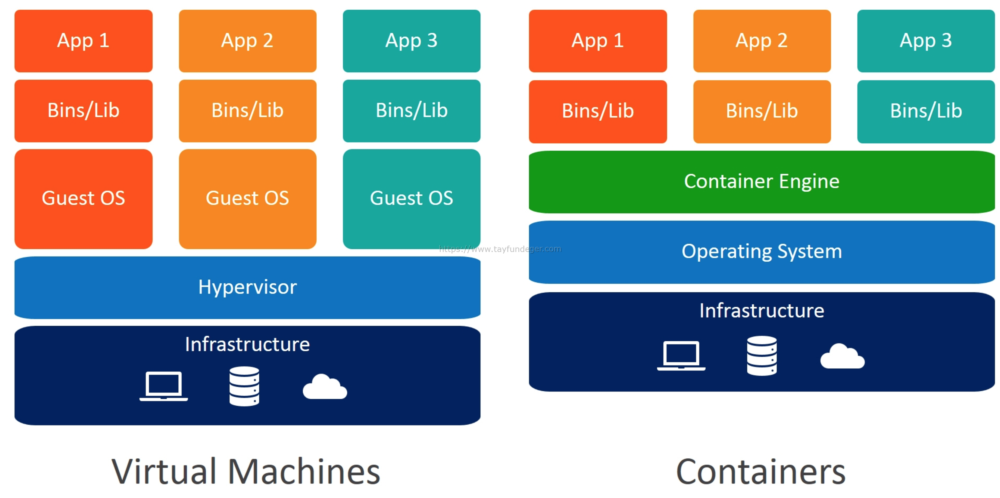

# Dockerize Node App
Jayas Piya

---


---

# What is Docker?

- Tool to run application on an isolated environment
- Automate software deployment
- Package all of its dependencies into a standardized unit

---

# Virtual Machine vs Container


<!-- 
Container builds on top of host machine. VMs run a complete operating system including its own kernel. Unlike, VMs that focus on infrastructure, container focuses on application.
-->

---

# Why Container?

- Smaller than virtual machine
- Easier environment setup
- Always runs on the same environment
- Isolate application
- No hassle of managing the tools and dependencies

---

# Terminology

- Container: Standardized unit to deploy application
- Image: Snapshot of container (OS, Software, Application)
- Docker Hub: Registry of docker images
- Dockerfile: File that automates creating image

---

# Gallery App

Express Server with Multer and MongoDb

```
https://github.com/zayazzp/dockerize-node-app.git
```
---

# Traditional Approach 
1. Install Node
2. Install Mongodb
3. Clone Project
4. Install Project Dependencies
5. Run Application

---

## Node Installation

```bash
curl -o- https://raw.githubusercontent.com/nvm-sh/nvm/v0.37.2/install.sh | bash
```
```bash
source ~/.bashrc
```
```bash
nvm --version
```
```bash
nvm install node
```
```bash
node --version
```

---

## MongoDB Installation

import the public key used by the package management system
```bash
wget -qO - https://www.mongodb.org/static/pgp/server-5.0.asc | sudo apt-key add -
```
Create list file 
```bash
echo "deb [ arch=amd64,arm64 ] https://repo.mongodb.org/apt/ubuntu focal/mongodb-org/5.0 multiverse" | sudo tee /etc/apt/sources.list.d/mongodb-org-5.0.list
```
Install & Run Mongodb
```bash
sudo apt update
```
```bash
sudo apt-get install -y mongodb-org
```
```bash
sudo systemctl start mongod
```

---

## Start Project

```bash
cd dockerize-node-app
```
```bash
npm install
```
```bash
node app
```

---

# Docker way

1. Install docker & docker-compose
2. Create Dockerfile
3. Build Image
4. Start Container

---

## Installation

```bash
sudo apt update
```
```bash
sudo apt install -y docker.io docker-compose
```

---

## What is Dockerfile?

- File with a list of steps to create container image
- Automate the image creation process

---

## Dockerfile

```dockerfile
# Base Image
FROM node:16
# Create Working Directory
WORKDIR /usr/src/app
# Copy all the files to Docker Container
COPY . .
# Install all dependencies
RUN npm install
# Expose docker port
EXPOSE 3000
# Start Project
CMD [ "node", "app.js" ]
```

---

## Start Project
Create Image with Dockerfile
```bash
sudo docker build . -t zayazzp/dockerize-node-app
```
Check Images
```bash
sudo docker images
```
Start Container
```bash
sudo docker run -p 3000:3000 -d zayazzp/dockerize-node-app
```
Check Process
```bash
sudo docker ps
```

---

## What is docker-compose?

- A tool to define and run multi-container docker application as a single service

---


## Why docker-compose?

- Each container is designed to run a single process
- Many application are composed of multiple services that need to work together and communicate with each other over network request.

---

## docker-compose.yml

```bash
sudo docker run -p 3000:3000 -d zayazzp/dockerize-node-app
```
```yml
services:  
    node:  
        build: .
        image: zayazzp/dockerize-node-app
        ports:  
            - "3000:3000"  
```

---

# Docker Compose in Action

```yml
version: "3"  
services:  
    node:  
        build: .
        image: zayazzp/dockerize-node-app
        ports:  
            - "3000:3000"  
        depends_on:  
            - mongo  
    mongo:  
        image: mongo  
        ports:  
            - "27017:27017"  
        volumes:  
            - data-volume:/data/db
volumes:
    data-volume:
```

---

# Connecting Express Server & MongoDB

> By default, services can reach other service by using the service’s name. We need to reach mongo service from node. That is why we need configure the database URI to mongodb://mongo:27017 in our express app

---

## Compose Command


```bash
sudo docker-compose build
```
```bash
sudo docker-compose up -d
```

---


